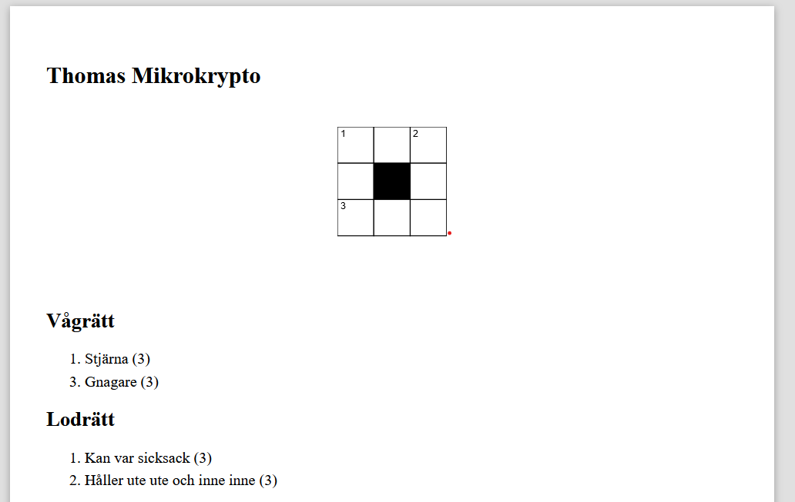
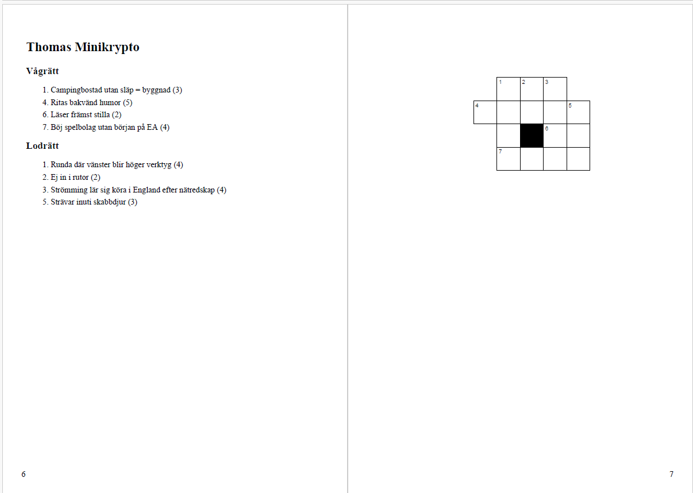

# ASCROSS Crossword Renderer

## Input
```
title = "Thomas Mikrokrypto"

# Write the crossword grid with letters.
# Capital letters insert a number (starting point).
# `.` blocks a cell.
# ` ` adds empty space
grid = """
SoL
ö.å
Mus
"""

# Map the clues to the corresponding word by
# giving a unique prefix.
# `<prefix>:<clue>`
clues_horizontal = """
S:Stjärna
M:Gnagare
"""

clues_vertical = """
S:Kan var sicksack
L:Håller ute ute och inne inne
"""

# Text written here will be added after all the other text
extra_text = """"""
```

## Output
```
python3 ascross.py crosswords.samples/*.toml --format a4 --page-num 1 --output crosswords.samples/a4.html
```


```
python3 ascross.py crosswords.samples/*.toml --format a5two --page-num 2 --output crosswords.samples/a5two.html
```

